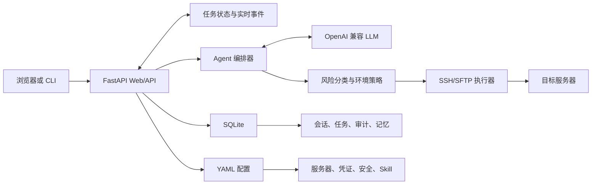

# Shell Agent 产品说明书

> 本文档依据 2026-07-16 的当前代码编写，描述已经实现并可使用的产品能力。规划中的功能会明确标注，不作为当前版本承诺。

| 项目 | 说明 |
| --- | --- |
| 产品名称 | Shell Agent |
| 当前版本 | 0.1.1 |
| 产品形态 | B/S 架构的本地或内网运维工作台 |
| 主要入口 | Web 工作台、CLI |
| 主要执行器 | SSH / SFTP |
| 默认 Web 地址 | `http://127.0.0.1:8010/` |
| 目标用户 | 研发、运维、测试、交付及技术负责人 |

## 1. 产品概述

### 1.1 产品定位

Shell Agent 是一款自然语言驱动的服务器运维助手。用户只需描述目标，例如“查看 dev-01 上 camel 服务最近的错误日志”或“在 aliyun-01 安装 MySQL”，系统会结合服务器清单、会话上下文、服务画像和全局记忆，决定是直接回答、生成命令、连续排查，还是先给出操作方案。

Shell Agent 不只是把自然语言翻译成 Shell 命令。它将一次请求组织成完整任务，覆盖：

1. 理解目标与目标服务器。
2. 选择直接命令、连续工作流、多服务器采集或操作方案。
3. 对每条命令进行风险分类和环境策略校验。
4. 在需要时等待用户确认或二次确认。
5. 执行命令并保留结果。
6. 根据上一条命令输出决定下一步。
7. 在任务结束后给出面向目标的结论。
8. 将关键操作写入审计，并从任务中提取可复用知识。

### 1.2 核心价值

- **降低运维门槛**：用户表达目标，无需先掌握完整命令组合。
- **支持连续任务**：下一步可依赖上一步输出，不需要用户逐条引导。
- **操作前可控**：修改系统状态的任务优先展示方案、影响、风险、回滚和验证方式。
- **执行过程可见**：展示思考、方案确认、命令执行、分析和完成等任务状态。
- **跨会话复用知识**：通过服务画像和全局记忆理解服务位置、路径和运维事实。
- **完整留痕**：命令、目标、风险、确认、结果和耗时可审计。

### 1.3 适用场景

- 查看磁盘、内存、CPU、端口、进程和服务状态。
- 查询日志、定位故障并连续验证可能原因。
- 跨多台服务器采集同类信息并汇总结论。
- 安装软件、修改配置、清理文件、管理定时任务和启停服务。
- 在聊天会话中上传文件并传输到目标服务器，为部署任务提供输入。
- 通过终端执行熟悉的 Shell 命令，同时保留安全控制和审计。
- 沉淀服务画像、运维事实和可复用 Skill。

## 2. 产品架构



### 2.1 技术组成

- 前端：Vue 3、TypeScript、Pinia。
- 后端：FastAPI、WebSocket、Python 3.11+。
- 模型：OpenAI 兼容接口，可配置模型、地址、超时和摘要模型。
- 远程执行：AsyncSSH，支持 SSH 命令和 SFTP 上传。
- 数据存储：SQLite 保存会话、消息、任务、审计和记忆；YAML 保存系统配置、资源清单和安全规则。
- 交互方式：REST 用于配置和数据管理，WebSocket 用于聊天与终端的实时事件。

### 2.2 当前部署形态

当前版本适合在个人电脑或受控内网中以单实例方式运行。Web 服务和任务编排在同一个应用进程内，关键状态持久化到 SQLite，以支持刷新页面或重启服务后的恢复。

当前未内置用户登录、角色权限和租户隔离，不应直接暴露到公网。需要远程访问时，应在外层增加反向代理、身份认证、HTTPS、访问控制和网络白名单。

## 3. 核心概念

| 概念 | 说明 |
| --- | --- |
| 服务器别名 | 系统引用服务器的唯一名称，例如 `dev-01`。LLM 和界面使用别名，不直接依赖真实 IP。 |
| 聊天会话 | 一组独立的自然语言上下文。不同会话之间的短期上下文相互隔离。 |
| 回合 | 从一条用户输入开始，到 Shell Agent 给出最终结论、失败或被停止为止的完整响应过程。 |
| 任务 | 回合中由后端管理的执行单元，具有唯一状态，可包含方案和多条命令。 |
| 操作方案 | 在改变服务器状态前展示的目标、步骤、影响、风险、回滚和验证说明。 |
| 命令预览 | 命令执行前的目标服务器、意图、实际命令、解释、风险和策略结果。 |
| 终端会话 | 面向直接命令的独立会话，每个服务器保留自己的目录、历史和输出。 |
| 服务画像 | 某个服务当前部署位置、目录、端口、启停命令和验证状态等结构化事实。 |
| 全局记忆 | 从多个会话中复用的事实、过程、偏好或观察，带来源、置信度和状态。 |
| Skill | 用 YAML 描述的可复用运维模板，包括触发条件、参数、步骤和安全属性。 |

## 4. 工作台导航

当前 Web 工作台包含六个一级页面：

| 页面 | 主要用途 |
| --- | --- |
| 聊天 | 用自然语言发起查询、排查、变更和部署任务。 |
| 终端 | 按服务器使用远程 Shell，支持目录状态、历史和自动补全。 |
| 资源 | 管理服务器、SSH 凭证和服务画像。 |
| 配置 | 管理 LLM、上下文、SSH、安全策略和 Skill。 |
| 记忆 | 查看和维护全局记忆、服务画像候选及冲突信息。 |
| 审计 | 查询命令预览、确认和实际执行留下的记录。 |

## 5. 聊天工作区

### 5.1 会话管理

- 新建多个聊天会话。
- 搜索、切换和删除历史会话。
- 每个会话维护独立的消息、短期上下文、待确认方案和任务状态。
- 切换到其他会话不会取消当前正在运行的任务。
- 再次切回会话时，前端会从后端恢复消息、任务、方案和待确认命令。
- 长对话按回合组织，并提供回合摘要和时间轴，避免一次渲染全部历史造成明显卡顿。

### 5.2 消息展示

- 用户输入右对齐，Shell Agent 输出左对齐。
- Agent 的一次回复按回合展示，内部可包含方案、命令步骤、执行输出和最终结论。
- 命令解释与风险默认可折叠，减少重复信息干扰。
- 较长命令输出支持截断展示和展开完整内容。
- 所有方案、命令和任务步骤均应明确标注目标服务器别名。

### 5.3 输入与任务控制

- `Enter` 发送，`Shift+Enter` 换行。
- Shell Agent 正在回复时，输入区不可再次发送，避免同一会话并发任务互相覆盖。
- 任务活动期间显示停止按钮，可终止当前 Agent 编排过程，并尽力取消正在等待的本地执行协程。
- 停止后任务进入已取消状态；已经执行的远端副作用不会自动回滚，失去 SSH 连接的远端进程也可能继续运行，需要额外检查。
- 若存在待确认方案或命令，应先确认、取消或调整，再开始新任务。

### 5.4 任务状态

聊天输入框上方展示的是当前回合的服务端任务状态，而不是最近一条消息的外观状态。

| 状态 | 用户含义 |
| --- | --- |
| 空闲 | 当前会话没有活动任务或待确认操作。 |
| 准备中 / 正在思考 | 正在整理上下文并调用 LLM。 |
| 正在生成方案 | 正在组织修改类任务的操作方案。 |
| 等待确认方案 | 方案已生成，等待用户确认、调整或取消。 |
| 正在生成命令 | 正在将当前目标转换为下一条可执行命令。 |
| 等待人工确认 | 命令已预览，但当前模式或风险要求用户确认。 |
| 正在执行命令 | 后端已开始执行当前命令。 |
| 正在执行任务 | 工作流仍有后续步骤需要判断或执行。 |
| 正在分析结果 | 正在根据命令结果判断下一步或形成结论。 |
| 正在生成最终结论 | 命令阶段结束，正在整理面向用户的结论。 |
| 任务完成 | 目标已完成，并已给出最终结果。 |
| 部分完成 | 已获得有效结果，但部分命令失败或部分目标未完成。 |
| 执行失败 / 超时 | 任务因命令、连接、模型或超时错误结束。 |
| 已取消 | 用户主动停止，或服务恢复时发现任务已失去执行所有权。 |

页面刷新后，前端以持久化任务状态为准重新渲染。已经结束的任务不会仅因历史中存在“正在执行”事件而重新显示为运行中。

### 5.5 Agent 的任务决策

LLM 根据用户目标自行选择处理方式：

| 类型 | 适用情况 | 行为 |
| --- | --- | --- |
| 直接回复 | 概念解释、无需服务器数据的问题 | 直接返回文字结论。 |
| 单命令 | 一条命令可完成的查询 | 生成一条命令并进入安全流程。 |
| Workflow | 下一步依赖上一条输出 | 逐步执行、分析结果，再生成下一步。 |
| Collect | 多台服务器执行同类查询 | 按目标采集数据后汇总。 |
| Analyze | 用户明确要求分析或总结 | 收集证据并形成结构化结论。 |
| Investigate | 故障原因未知，需要迭代排查 | 根据每一步结果继续验证假设。 |
| Operation Plan | 安装、删除、部署、清理、写配置、定时任务、权限或服务变更 | 先生成方案，确认后执行。 |

任务没有固定的“三步”或“六步”上限。系统以 LLM 判断目标是否完成为主；方案已明确列出的步骤会显示总数，排查型任务则可根据结果继续产生后续步骤。系统仍会受模型超时、命令超时、用户停止和安全策略约束。

### 5.6 操作方案

涉及服务器状态变化时，方案至少包含：

- 任务目标和目标服务器。
- 推荐做法。
- 影响范围。
- 风险点。
- 回滚方式。
- 验证方式。
- 确认后将执行的步骤和命令草案。

用户可以：

1. 确认方案并进入执行。
2. 用自然语言提出调整，例如“不要备份，直接删除”。
3. 取消方案。

方案确认不等于绕过命令安全。方案转为实际步骤后，每条命令仍会重新进行风险分类和环境策略检查。

### 5.7 最终结论

每个完整任务结束后，Shell Agent 应基于实际输出说明：

- 在哪台服务器执行了什么。
- 目标是否完成。
- 成功、失败或部分完成的证据。
- 关键结果和异常原因。
- 必要时给出后续建议。

命令退出码不等于业务结论。例如，用 `grep` 查无匹配或用 `ls` 验证文件不存在时可能返回非零退出码，但这仍可能证明用户目标已经达成。系统会保留退出码，同时让最终结论结合命令意图和输出判断。

### 5.8 长会话上下文压缩

当会话超过配置阈值后，系统会：

- 保留最近消息和关键事件原文。
- 使用摘要模型压缩较早历史。
- 提取服务器、路径、命令、结果、约束、异常和待办事项。
- 将摘要持久化到 SQLite，后续只处理新增内容。
- 摘要模型失败时退化为规则压缩，不阻断当前会话。
- 在送入摘要模型前清理常见 API Key、Token、私钥和连接串口令。

上下文压缩用于维持会话连续性，不替代审计记录，也不保证识别所有用户自行写入的敏感信息。

### 5.9 会话附件

聊天会话支持上传辅助材料，例如日志、配置、源码、CSV、PDF、Office 文档、图片和压缩包。

- 单个会话最多 30 个文件。
- 单文件最大 512 MB。
- 文件保存在本机 `data/session_files/<session_id>/`。
- 文本类文件会提取与当前问题相关的有限片段。
- PDF、图片，以及 DOC/DOCX、XLS/XLSX、PPT/PPTX 提供相应的解析或预览能力。Office 文件可在“版式”PDF 预览与“提取文本”之间切换；前者尽量保留原始排版，后者进入搜索与 Agent 上下文。原始文件始终保留用于下载和服务器传输。
- ZIP、TAR、JAR、WAR 等仅读取受限元数据和文件清单，不会因上传而自动执行或解压。
- 文件内容被视为不可信数据，不能覆盖系统安全要求。

聊天附件默认只作为本地分析材料。需要把附件写入目标服务器时，可在聊天页文件侧栏选择“传到服务器”，确认目标服务器、远端目录和文件名后通过 SFTP 传输。传输成功会记录远端路径、大小和 SHA-256，并写入当前会话上下文；系统不会因此自动部署、解压或执行该文件。

## 6. 终端工作区

终端工作区参考常见 SSH 客户端的使用方式，适合已经知道具体命令的用户。

### 6.1 主要能力

- 新建、搜索、切换和删除终端会话。
- 在工具栏选择目标服务器。
- 直接输入 `df -h`，也可输入完整的 `ssh alias 'command'`。
- `cd` 会改变当前终端会话在该服务器上的逻辑工作目录。
- 提示符显示当前服务器和目录。
- 上、下方向键浏览历史命令。
- `Tab` 补全常用命令或远端路径，多个候选项会显示补全菜单。
- 可停止正在执行的命令。
- 需要确认时在终端内显示确认区和二次确认输入。

### 6.2 会话隔离

终端状态按“终端会话 + 目标服务器”隔离。切换服务器后，每台服务器分别保留：

- 当前工作目录。
- 命令历史。
- 终端输出。

因此，用户从 `dev-01` 切换到 `aliyun-01` 再切回时，不会混用目录和输出。

### 6.3 安全模式

当前模块化终端固定使用“安全自动”模式：明确安全的只读命令可直接执行，其他命令进入确认流程。终端不提供“完全访问”快捷切换，避免把传统终端误用成无保护执行入口。

## 7. 资源工作区

资源页统一维护服务器连接信息、SSH 凭证和服务画像。

### 7.1 服务器

可新增、编辑和删除服务器，主要字段包括：

- 别名、主机、端口。
- 环境标签，例如 `dev`、`test`、`prod`。
- SSH 凭证引用。
- 可选角色和标签。

服务器别名是 Agent 生成命令、会话选择目标和审计检索的主要标识。修改别名前，应确认现有服务画像、记忆和历史任务是否仍引用旧别名。

### 7.2 SSH 凭证

支持密码和私钥两类 SSH 凭证。凭证密文由后端保存，列表页不回显原始密码或私钥。

凭证 ID 是服务器记录关联凭证的内部引用，不是远端系统账号。多个服务器可以复用同一凭证记录，也可以各自使用独立凭证。

### 7.3 服务画像

服务画像用于记录当前可验证的服务状态，主要包括：

- 服务名称、环境、负责人和绑定服务器。
- 部署目录、日志目录和配置路径。
- 端口、健康检查地址、运行方式和版本。
- 启动、停止、重启和状态检查命令。
- 最近验证时间、状态、来源任务、修订号、标签和备注。

服务画像是“当前结构化事实”的优先来源。例如全局记忆认为 MySQL 在 `dev-01`，而已确认服务画像表明它在 `aliyun-01`，系统应优先采用服务画像，并提示冲突需要复核。

## 8. 配置工作区

配置页按分组展示，每个分组独立展开；各配置项带有说明提示。

### 8.1 LLM 配置

| 配置 | 作用 |
| --- | --- |
| Provider | 选择兼容的模型服务协议。 |
| Model | 命令生成、分析和方案生成使用的模型。 |
| Summary Model | 长会话摘要使用的模型；为空时可复用主模型。 |
| API Key | 模型服务密钥，保存后不在页面回显原值。 |
| Base URL | 官方地址、代理地址或私有模型网关地址。 |
| Temperature | 控制输出随机性，运维场景建议较低。 |
| Timeout | 单次 LLM 请求等待上限。 |

支持保存配置和测试模型连接。

主模型的 `max_tokens` 当前可在 `config/agent.yaml` 中配置，模块化配置页尚未提供对应输入项。

### 8.2 上下文配置

可配置是否启用语义摘要、触发事件数、触发字符数、保留最近事件数、摘要最大字符数和估算令牌上限。

### 8.3 SSH 配置

可配置单服务器最大连接数、空闲连接超时、全局连接上限、默认命令超时和是否信任未知 Host Key。

开发环境可以按需要信任未知 Host Key；生产或高敏环境应使用明确的主机指纹校验。

### 8.4 安全策略

安全策略支持：

- 按环境配置二次确认。
- 指定需要二次确认的风险等级。
- 禁用特定执行器。
- 使用 JSON 配置危险操作允许时间窗口。
- 维护 Safe 命令正则。
- 维护自定义风险规则、等级和原因。
- 在不执行命令的情况下测试分类结果。

保存安全策略后，新生成的命令按最新规则判断；已经执行的历史审计不会被重算。

### 8.5 Skill 配置

当前内置模板包括：

- `resource_summary`：服务器资源概览。
- `list_directory`：列出目录内容。
- `java_processes`：查看 Java 进程。
- `tail_latest_log`：查看最新日志。

配置页当前支持查看 Skill 详情和编辑现有 YAML。后端已经提供创建、更新和删除接口，但模块化界面的新增、删除入口仍需继续完善。

Skill 通常包含名称、说明、分类、触发词、参数、步骤和安全属性。保存时会进行结构校验，重要变更写入审计。

## 9. 记忆工作区

### 9.1 全局记忆

全局记忆用于跨聊天会话复用知识，例如：

- 某个软件安装在哪台服务器。
- 某个服务的部署路径或日志路径。
- 经验证的排查流程。
- 用户长期偏好或约束。

记忆类型包括事实、过程、偏好和观察；状态包括推断、已确认、已提升、已过期和冲突。每条记忆可包含目标服务器、置信度、有效期和证据来源。

用户可搜索、筛选、新增、编辑和删除记忆。涉及写操作时，如果目标服务器只由低置信度记忆推断，Agent 应要求确认目标，不应直接执行。

### 9.2 记忆与服务画像的区别

| 对比项 | 服务画像 | 全局记忆 |
| --- | --- | --- |
| 内容 | 当前服务的结构化配置与部署状态 | 跨会话事实、经验、偏好和观察 |
| 可信度 | 经确认后作为服务当前状态来源 | 可处于推断、确认、过期或冲突状态 |
| 结构 | 固定字段，便于直接参与运维决策 | 更灵活，适合保存经验和关联事实 |
| 更新 | 人工维护或接受任务产生的候选 | 人工维护或从任务中推断 |
| 冲突处理 | 与记忆冲突时通常优先 | 标记冲突并等待复核 |

### 9.3 任务学习候选

任务结束后，系统可从已验证结果中提取：

- 新的全局记忆候选。
- 服务画像新增或更新候选。

候选不会无条件覆盖现有数据。用户可以查看当前值与建议值，接受原建议、编辑后接受或拒绝。这样可以让 Agent 逐步积累知识，同时保留人工控制。

## 10. 审计工作区

审计记录可包含：

- 时间、会话和来源。
- 目标服务器和环境。
- 执行器、命令和风险等级。
- 确认模式、是否执行、是否二次确认。
- 退出码、耗时、超时和截断状态。
- 标准输出、错误输出和错误原因。
- 配置或 Skill 等重要管理操作。

页面支持按目标服务器筛选。审计用于追踪和复盘，不是完整的堡垒机审批系统；当前版本尚未提供多用户身份归属、不可篡改存储和正式审批流。

## 11. 安全与权限模式

### 11.1 风险等级

| 等级 | 典型含义 | 示例 |
| --- | --- | --- |
| `safe` | 明确的只读、低风险命令 | `pwd`、受限 `ls`、`df -h` |
| `caution` | 只读但范围较大、包含网络请求或语法不够明确 | 大范围 `find`、`curl`、复杂复合查询 |
| `dangerous` | 会改变文件、软件、配置或服务状态 | 写文件、安装包、启停服务、删除普通文件 |
| `critical` | 高危、不可逆或影响范围极大的操作 | 递归强制删除、格式化磁盘、删库、清空关键数据 |

分类器采用保守策略。未命中明确 Safe 规则或包含复杂 Shell 语法的命令，可能被提升为 `caution` 或更高等级。

### 11.2 聊天权限模式

| 中文模式 | 内部值 | 行为 |
| --- | --- | --- |
| 交互确认 | `interactive` | 每条命令都需要用户确认。 |
| 安全自动 | `auto_safe` | `safe` 命令自动执行，其他等级等待确认。默认使用此模式。 |
| 仅预览 | `dry_run` | 只生成方案和命令预览，不执行远端命令。 |
| 完全访问 | `full_access` | 普通风险命令可由 Agent 自动执行并跳过人工、二次确认，但仍受环境阻断策略和灾难性命令硬阻断约束。 |

选择“完全访问”不表示关闭安全系统。以下类型始终阻断或要求更严格的处理：

- 对根目录或根通配符执行递归强制删除。
- `mkfs`、`mke2fs`、`wipefs` 等文件系统格式化。
- 使用 `dd` 直接写入块设备。
- 命中环境禁用执行器、时间窗口或其他强制策略的操作。

### 11.3 二次确认

在交互确认和安全自动模式下，环境策略可要求用户输入目标服务器别名完成二次确认，适用于生产环境中的 `dangerous` 或 `critical` 命令。命令确认后，按钮会进入已处理状态，不能重复点击执行。完全访问模式会跳过二次确认，但不会绕过禁用执行器、时间窗口和灾难性命令硬阻断。

### 11.4 目标服务器约束

- 所有命令、方案、任务步骤和最终结论必须明确目标服务器别名。
- 用户明确指定服务器时，不应被当前默认服务器覆盖。
- 多服务器任务必须列出全部目标。
- 写操作目标不明确时，Agent 应先询问或生成待确认方案。
- 服务画像与记忆冲突时，优先使用已确认服务画像并提示复核。

## 12. 典型操作流程

### 12.1 首次使用

1. 在“配置 > LLM”填写模型、API Key 和 Base URL，并测试连接。
2. 在“资源 > SSH 凭证”新增密码或私钥凭证。
3. 在“资源 > 服务器”新增服务器并绑定凭证。
4. 在“配置 > 安全策略”确认各环境规则。
5. 进入聊天页，新建会话并发送只读查询进行验证。

### 12.2 单服务器只读查询

用户输入：

```text
查看 dev-01 的磁盘和内存使用情况
```

系统行为：识别目标 `dev-01`，生成只读命令，完成风险分类，在安全自动模式下直接执行，展示输出并给出资源结论。

### 12.3 连续故障排查

用户输入：

```text
看看 dev-04 上的 MySQL 为什么启动失败
```

系统行为：先检查服务状态，再根据输出查看日志、磁盘、权限或配置；下一条命令依赖上一条结果，直到定位原因或没有可靠的后续动作，最后总结证据与建议。

### 12.4 修改服务器状态

用户输入：

```text
清理 dev-04 上两天前的 TDengine 历史日志，然后重启 MySQL
```

系统行为：先生成操作方案，明确删除范围、风险、回滚和验证步骤；用户确认后逐条执行，并在最后验证磁盘和 MySQL 状态。

### 12.5 上传并部署制品

1. 在聊天会话中上传 JAR、WAR、TAR、ZIP 或其他文件。
2. 在文件侧栏选择“传到服务器”，填写目标服务器、远端目录和文件名。
3. 核对传输结果中的远端路径、大小和 SHA-256。
4. 在当前聊天中说明“部署刚传到服务器的包”，Agent 会使用该会话记录的目标和远端路径生成部署方案。
5. 用户确认后执行备份、替换、权限处理、启动和健康验证。

### 12.6 使用终端

1. 新建终端会话。
2. 选择服务器。
3. 输入 `cd /data/app`。
4. 输入 `ls -lh` 或按 `Tab` 补全路径。
5. 切换服务器后，原服务器的目录和历史仍独立保留。

## 13. 安装、启动与命令行

### 13.1 环境要求

- Python 3.11 或更高版本。
- 能访问模型 API。
- 运行机器能通过 SSH 连接目标服务器。
- 仅在前端开发或重新构建时需要 Node.js 和 npm。

### 13.2 安装

```bash
cd /path/to/opsane
python3.11 -m venv .venv
source .venv/bin/activate
pip install -e ".[dev]"
```

### 13.3 初始化配置

仓库已经包含配置时可直接使用；新环境可从示例复制：

```bash
cp config/agent.yaml.example config/agent.yaml
cp config/inventory.yaml.example config/inventory.yaml
cp config/credentials.yaml.example config/credentials.yaml
cp config/safety/env_policies.yaml.example config/safety/env_policies.yaml
cp config/safety/safe_commands.yaml.example config/safety/safe_commands.yaml
cp config/safety/forbidden_patterns.yaml.example config/safety/forbidden_patterns.yaml
```

请勿把包含真实密钥的配置文件提交到代码仓库。

### 13.4 启动 Web 服务

```bash
source .venv/bin/activate
opsane serve --host 127.0.0.1 --port 8010
```

访问：

- `http://127.0.0.1:8010/`：自动进入当前模块化工作台。
- `http://127.0.0.1:8010/next/#/chat`：聊天页直接地址。

### 13.5 前端开发

```bash
cd shell_agent/web/frontend
npm install
npm test
npm run dev
npm run build
```

生产构建输出到 `shell_agent/web/static/next/`，由 Python Web 服务统一提供。

### 13.6 CLI

```bash
# 自然语言任务
opsane run "查看 dev-01 的磁盘使用情况"

# 直接命令
opsane exec "ssh dev-01 'df -h'"

# 交互式 REPL
opsane shell

# 查询审计
opsane audit query --target dev-01
```

CLI 支持交互确认、安全自动和仅预览；“完全访问”当前主要由 Web 聊天工作区提供。

## 14. 数据与安全说明

### 14.1 本地数据

系统会在本机保存：

- SQLite 会话、消息、任务、审计和记忆数据。
- YAML 服务器、凭证、安全和应用配置。
- 聊天附件。
- 应用日志。

备份时应同时保护 `data/` 和 `config/`，并按敏感数据处理。

### 14.2 敏感信息

- API Key 和 SSH 密文不会在管理列表中原样回显。
- 上下文摘要会尝试清理常见密钥和口令格式。
- 用户若把密码直接写进自然语言或 Shell 命令，密码仍可能出现在聊天消息、命令输出、模型请求或审计记录中。
- 建议使用 SSH 凭证、环境变量、受控密钥文件或交互式输入，不要在命令行中直接拼接生产口令。

### 14.3 命令输出限制

为控制页面和上下文体积，远程命令输出可能被截断。需要分析大日志时，应使用 `tail`、时间范围、关键词和行数限制，不应一次读取完整日志文件。

长时间前台任务可能超过默认 SSH 命令超时。适合的做法是由 Agent 采用后台启动、记录 PID、轮询状态和读取有限日志的工作流。

## 15. 当前限制

当前版本已经形成可用闭环，但仍存在以下产品边界：

1. **无内置 Web 登录和 RBAC**：仅适合受控本机或内网环境。
2. **单实例运行**：没有分布式任务队列、多实例抢占和高可用调度。
3. **主要执行器为 SSH**：数据库、Kubernetes、云平台等尚未形成独立执行器。
4. **模型仍可能出错**：错误命令、错误目标或不准确总结仍需依靠预览、方案和验证约束。
5. **命令分类偏保守**：复杂只读命令可能被判定为较高风险，需要人工确认。
6. **终止不等于回滚**：停止任务只阻止后续动作，已经执行的远端操作不会自动撤销。
7. **超时不能证明远端已停止**：网络超时后，远端进程可能仍在运行，需要额外检查 PID 或服务状态。
8. **Skill 管理入口未完全闭环**：当前 UI 支持查看和编辑，新增、删除和版本管理仍需完善。
9. **审计不是堡垒机**：尚无不可篡改存储、审批流和多用户责任归属。
10. **敏感信息保护不是绝对的**：用户直接输入到命令中的密码可能进入历史和审计。

## 16. 验收要点

可通过以下场景确认系统是否正常：

- 新建两个聊天会话，确认上下文互不污染。
- 在任务执行中切换会话再切回，确认状态和结果可以恢复。
- 刷新页面，确认已完成任务显示空闲，待确认任务仍可继续处理。
- 在安全自动模式下执行 `df -h`，确认无需人工确认。
- 生成删除或服务重启任务，确认先出现方案或命令确认。
- 在完全访问模式下尝试灾难性根目录删除，确认被硬阻断。
- 在终端中切换两台服务器，确认目录、历史和输出独立。
- 在聊天会话中上传文件并传输到服务器，确认目标路径、大小、SHA-256、会话事件和审计记录存在。
- 接受一条记忆或服务画像候选，确认后续会话可以复用。
- 执行多步排查，确认最终有基于实际输出的结论，而不只停留在命令结果。

## 17. 一句话说明

Shell Agent 是一个把自然语言目标转换成可控、可持续、可审计运维任务的本地工作台：简单查询直接执行，复杂排查连续推进，状态变更先出方案，高风险操作始终受安全策略约束。
